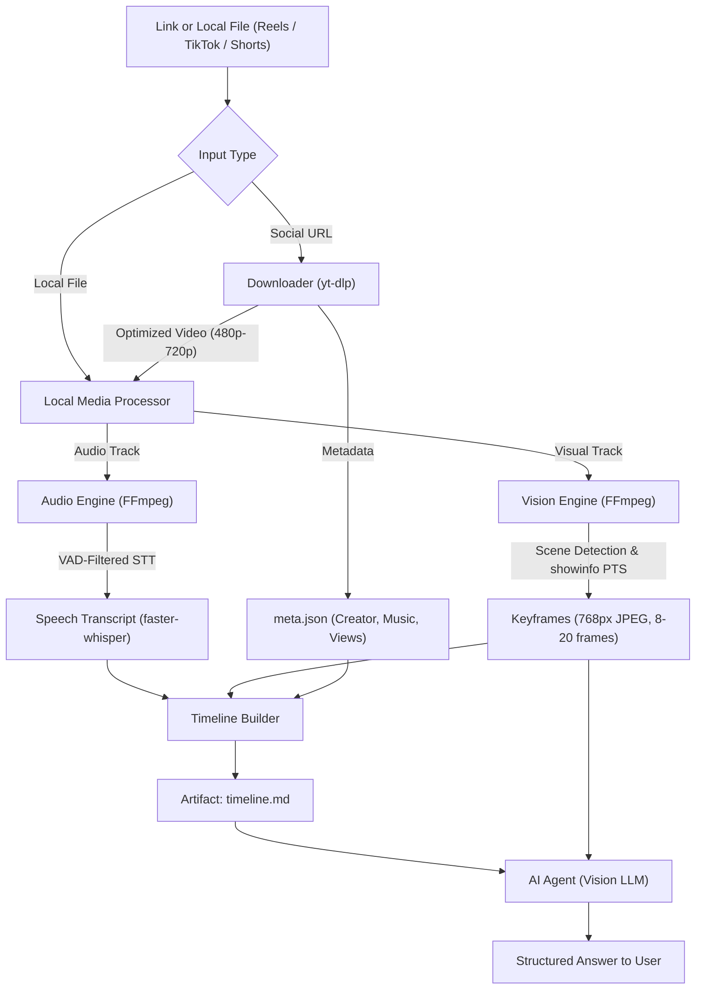

# /agent-reels-viewer

<p align="center">
  <a href="https://github.com/waniyaro/agent-reels-viewer">
    
  </a>
  <a href="https://github.com/waniyaro/agent-reels-viewer/actions/workflows/ci.yml">
    
  </a>
  <a href="https://github.com/waniyaro/agent-reels-viewer/blob/main/LICENSE">
    
  </a>
</p>

<p align="center">
  
  
  
  
</p>

<p align="center">
  <b>Local-first multimodal video intelligence for AI agents: “watch”, transcribe, zoom, and understand Reels, TikTok, and Shorts without monthly API fees.</b>
</p>

---

## Quick Install for AI Agents

**Claude Code, Cursor, Codex, Gemini CLI, Antigravity, OpenClaw, or 50+ [Agent Skills](https://agentskills.io) hosts:**
```bash
npx skills add waniyaro/agent-reels-viewer -g
```
*(`-g` installs globally across all agent sessions. Omit `-g` to install into the current project only).*

**Or install directly into your Python environment:**
```bash
pip install -e ".[speech]"
```

**Zero external API keys. Zero monthly subscriptions.** Run `agent-reels-viewer doctor` once to verify local FFmpeg and Whisper dependencies.

---

## Why AI Agents Are Blind to Short-Form Video

Most video summarizers only download YouTube subtitles via open APIs. That approach breaks completely on short-form social video:

| Challenge | Long-Form YouTube | Instagram Reels, TikTok & Shorts |
| :--- | :--- | :--- |
| **Subtitles** | Clean text track via public API | Hardcoded (burned-in) on-screen text, sticker captions, code snippets |
| **Core Meaning** | 90% in spoken monologue | 80% in **visuals, memes, POV overlays, and screen demonstrations** |
| **Audio Track** | Clear continuous speech | Often background music, trending phonk, or sound effects |
| **Platform Access** | Open HTTP requests | Bot protections, rate-limits, and login checkpoints |

If an agent only transcribes the audio of a silent Reel or meme, it hears background music and understands nothing. **Agent Reels Viewer solves this with an adaptive multimodal pipeline.**

---

## What Agents Actually Use It For

### 1. Debugging Code from Video Screencasts
```bash
agent-reels-viewer inspect "https://www.tiktok.com/@dev/video/7106594312292453675" --json
```
> The user shares a TikTok showing a terminal error. The skill extracts visual keyframes at real presentation timestamps (PTS), allowing the host Vision LLM to read the exact terminal traceback and propose a fix.

### 2. Targeted Second-Pass Zooming (`frames`)
```bash
agent-reels-viewer frames "session_c7d7166406" --from-sec 12.0 --to-sec 15.5 --count 6 --hires
```
> When crucial code or small UI elements are shown for only a few seconds, the agent issues a high-resolution zoom request for that exact time slice without re-downloading the video.

### 3. Understanding Silent Memes & Trending Tutorials
> Reels with no spoken dialogue are automatically detected (`speech_status: "none"`). The engine automatically shifts frame budget toward visual scene changes (up to 20 keyframes) so on-screen text and actions are never missed.

### 4. Preserving Host LLM Context & Budget
> Full video feeds consume thousands of tokens per second. Agent Reels Viewer samples only informative scene cuts (8–20 keyframes, 768px JPEG), calculates exact `estimated_image_tokens`, and formats everything into a clean chronological `timeline.md`.

---

## Sources & Formats Supported

| Platform | URL Pattern | Audio / Speech | Visual Keyframes | Metadata |
| :--- | :--- | :--- | :--- | :--- |
| **Instagram Reels** | `instagram.com/reel/...` | faster-whisper | Real PTS FFmpeg | Author, Likes, Description |
| **TikTok** | `tiktok.com/@.../video/...` | faster-whisper | Real PTS FFmpeg | Author, Sound, Play Count |
| **YouTube Shorts** | `youtube.com/shorts/...` | faster-whisper | Real PTS FFmpeg | Title, Channel, Duration |
| **Local Video Files** | `./clip.mp4`, `.mov`, `.webm` | faster-whisper | Real PTS FFmpeg | File Size, Duration, Codec |

---

## Architecture



### Key Architectural Decisions:
1. **Artifacts Over Extra LLM API Calls**: Generates clean local files (`timeline.md`, `frames/`, `meta.json`). The hosting agent uses its own native vision and file-reading tools. **Zero extra API keys or vendor lock-in.**
2. **Real Presentation Timestamps (PTS)**: Extracted directly from FFmpeg `showinfo` (`pts_time`), precisely aligning speech timestamps with visual transitions.
3. **Interval-Bucket Keyframe Capping & Tiled Deduplication**: Partitions video timeline into `effective_max` equal intervals. Guarantees temporal coverage (`gap <= 2 * duration / cap`) and greedily retains the highest visual change score per bucket while eliminating duplicates.
4. **Isolated Process Transcription with Hard OS Timeout**: Whisper inference runs in an isolated worker process with strict timeouts (`max(30, 3*duration)`), eliminating thread deadlocks.
5. **Universal H.264 Priority & AV1 Diagnostics**: Enforces `avc1` (H.264) in MP4 over AV1 for maximum compatibility and GPU/CPU decoding speed. Built-in `doctor` inspects AV1 decoders (`libdav1d`, `libaom-av1`).
6. **Automatic Cleanup & TTL Retention**: Temporary `audio.mp3` is purged in `finally` blocks immediately after speech transcription. Cached sessions are pruned automatically according to `AGENT_REELS_TTL_HOURS`.

---

## Interactive Timeline Artifact (`timeline.md`)

Each run produces an easy-to-read chronological timeline artifact:

```markdown
# Multimodal Video Timeline: Quick React 19 Action Hooks Demo
- **Source**: https://www.youtube.com/shorts/...
- **Duration**: 24.5s | **Speech**: English (confidence: 0.94)
- **Token Impact**: ~3,200 image tokens (12 keyframes @ 768px)

## Chronological Stream

- **[00:00.00 - 00:03.20]** 🗣️ *"Stop writing manual loading state booleans in React 19."*
  - 🖼️ `frames/frame_01_pts0.00.jpg` (Visual: Host introduces new useActionState hook)

- **[00:03.20 - 00:08.50]** 🗣️ *"Instead, use useActionState to handle async mutations directly."*
  - 🖼️ `frames/frame_02_pts4.12.jpg` (Visual: Code comparison on screen showing syntax)

- **[00:08.50 - 00:15.00]** 🗣️ *"Notice how isPending is updated automatically without useState."*
  - 🖼️ `frames/frame_03_pts9.84.jpg` (Visual: Highlighted terminal and browser output)
```

---

## CLI & Agent Commands

### 1. Diagnostics (`doctor`)
Inspects system binaries, AV1 decoders, Python packages, and optional cookie status:
```bash
agent-reels-viewer doctor
# Optional: pre-cache Whisper weights before first run
agent-reels-viewer doctor --download-model --model base
```

### 2. Inspect Video (`inspect`)
```bash
# Standard multimodal run (JSON summary for agent tools)
agent-reels-viewer inspect "https://www.instagram.com/reel/..." --json

# Deep inspection for fast code screencasts (more keyframes, finer deduplication)
agent-reels-viewer inspect "https://www.tiktok.com/@.../video/..." --mode deep --json

# Inspect local video file
agent-reels-viewer inspect "./recordings/bug_demo.mp4" --json

# Cap maximum frames to preserve LLM token context
agent-reels-viewer inspect "<URL>" --max-frames 6 --json

# Skip speech pass on silent clips
agent-reels-viewer inspect "<URL>" --no-speech --json
```

### 3. Targeted Zoom (`frames`)
Extracts a dense series of high-resolution keyframes from an existing session:
```bash
agent-reels-viewer frames "session_c7d7166406" --from-sec 10.0 --to-sec 14.5 --count 6 --hires
```

### 4. Cache Cleanup (`clean`)
```bash
# Delete sessions older than 3 days
agent-reels-viewer clean --days 3

# Wipe all cached sessions immediately
agent-reels-viewer clean --days 0
```

---

## Configuration & Environment Variables

| Variable | Default | Description |
| :--- | :--- | :--- |
| `AGENT_REELS_TTL_HOURS` | `24` | Hours to retain cached session folders before auto-pruning. |
| `AGENT_REELS_OUTPUT_DIR` | `~/.cache/agent-reels-viewer` | Base storage directory for sessions and media artifacts. |
| `WHISPER_MODEL` | `base` | Default Whisper model size (`tiny`, `base`, `small`). |

---

## Verification & Test Suite

Agent Reels Viewer includes a comprehensive test suite of **57 tests** executed across **12 matrix configurations** on GitHub Actions:
- **Platforms**: Ubuntu, macOS, Windows
- **Python Versions**: 3.10, 3.11, 3.12, 3.13

Run the unit tests locally:
```bash
python -m unittest discover -s tests -p "test_*.py"
```

---

## Contributing

We welcome contributions! Please see [CONTRIBUTING.md](CONTRIBUTING.md) for contribution guidelines, and [AGENTS.md](AGENTS.md) for coding conventions and architecture details.

## License

This project is licensed under the [MIT License](LICENSE).
